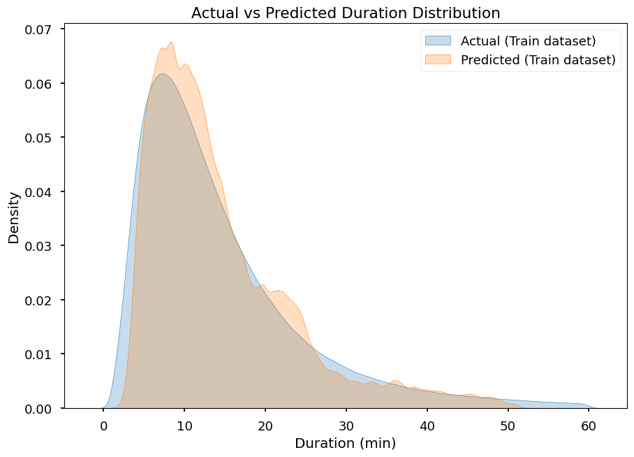
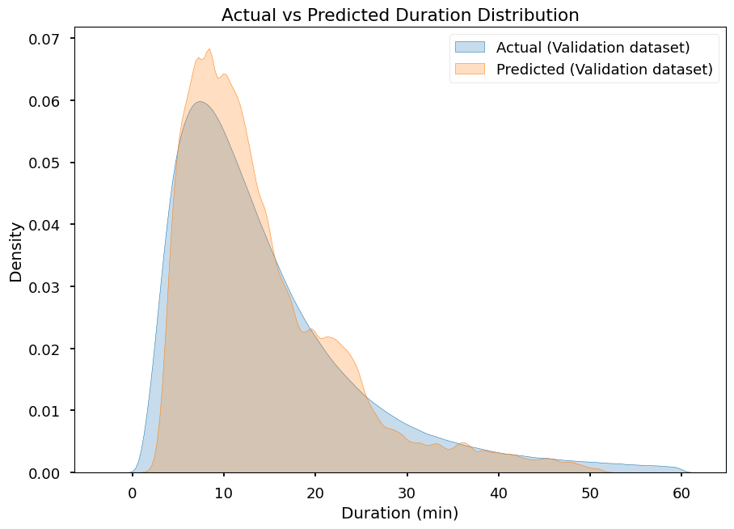

# Trotro MLops: Predicting the duration of a taxi ride

## Introduction

In the realm of urban mobility, accurately predicting taxi ride durations is crucial for optimizing logistics and enhancing user experience.

**Trotro MLops** project designed to leverage Machine Learning techniques for predicting taxi ride durations. By adhering to MLOps principles, this project seeks to facilitate efficient model development, deployment, and monitoring, ensuring that our predictions are both reliable and scalable.

## Table of Contents

- [Introduction](#introduction)
- [Machine Learning Modeling and Experiment Tracking](#machine-learning-modeling-and-experiment-tracking)
- [Orchestration](#orchestration)

## Machine Learning Modeling and Experiment Tracking

The dataset for training, testing, and validation was downloaded from New York City Taxi and Limousine Commission. The [January 2024 data](https://d37ci6vzurychx.cloudfront.net/trip-data/yellow_tripdata_2024-01.parquet) was used for training, while the [February 2024 data](https://d37ci6vzurychx.cloudfront.net/trip-data/yellow_tripdata_2024-02.parquet) was utilized for validation.

Hyperparameter tuning with Bayesian optimization was performed, leveraging the `hyperopt` Python library. The final model was trained with the best hyperparameters and full training data, which included both the training and validation datasets. The [March 2024 data](https://d37ci6vzurychx.cloudfront.net/trip-data/yellow_tripdata_2024-03.parquet) was used for scoring the model.

Experimentation variables, features, metrics, parameters, and models are tracked with **MLFlow**. Some of the artifacts that were saved with MLFlow are the plots of predictions from an XGBoost regressor on the training and validation sets.

| Training Dataset Prediction | Validation Dataset Prediction |
|-----------------------------|-------------------------------|
|   |  |

Future work:

- Feature importance analysis and interpretability with tools such as  SHAP and [IntepretML](https://interpret.ml/)
- Model fairness evaluation with [FairLearn](https://fairlearn.org/)
- Model explanation and interpretability with counterfactuals, using [DICE](https://interpret.ml/DiCE/)

## Orchestration

Machine Learning pipeline orchestration was build around Microsof Azure Machine Learning. This implementation is similar the project found [here](https://github.com/kennedyopokuasare/Azure_datascience). For easier reproducability, this project uses [GitHub Actions as a build system to orchestrate the model hyperparameter tuning, training, and scoring](https://github.com/kennedyopokuasare/trotro_mlops/actions/workflows/verify.yml).

## Deployment

MLOps engineers need to test the model against specific quality metrics before deploying it to staging or production. In this project, the model is served through a Flask web service and containerized with Docker. GitHub Actions is used to set up an integration test that calls the web service endpoint in the Docker container.
